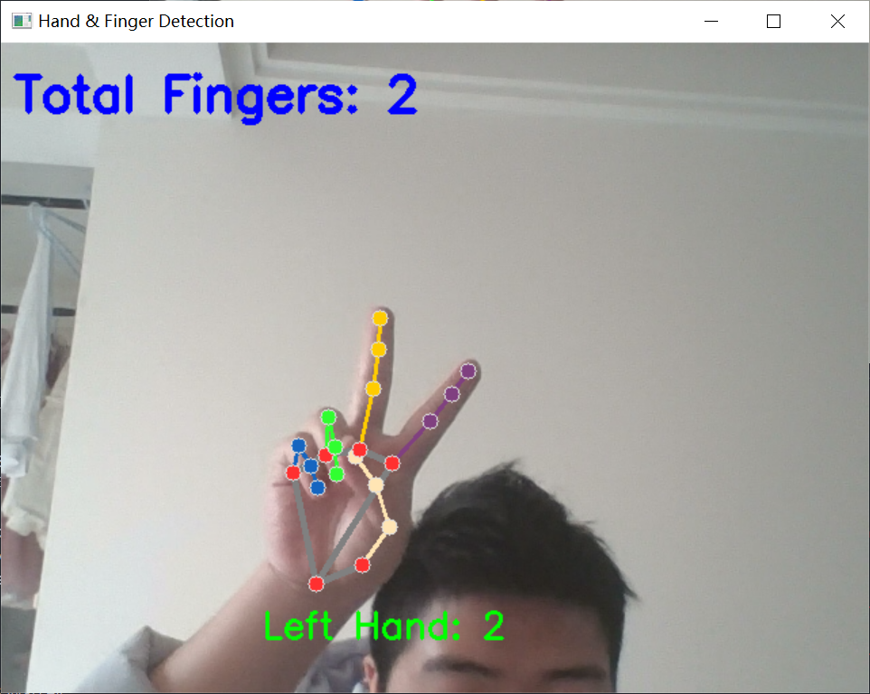
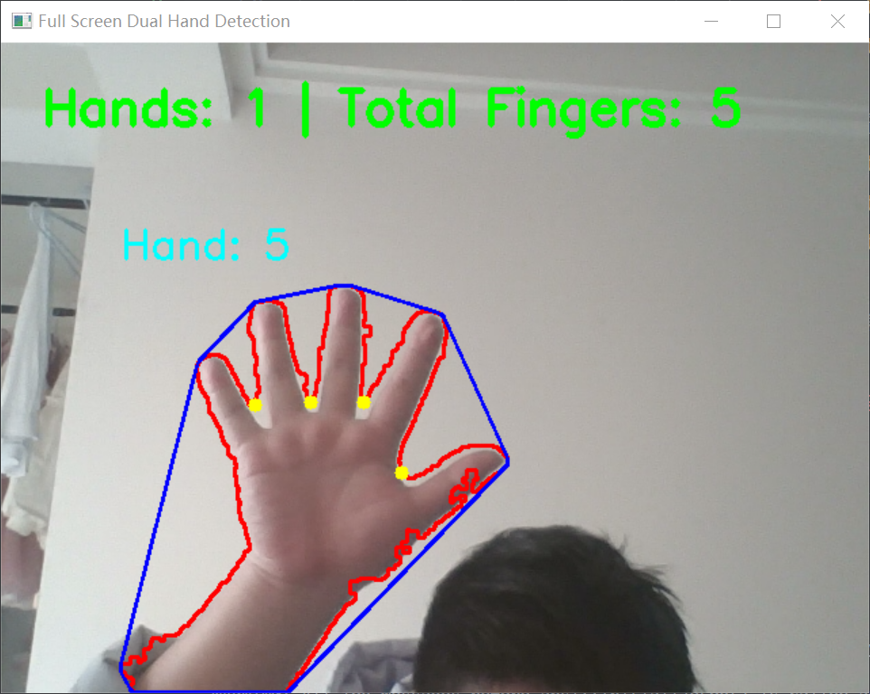

# ✋ 手势识别与手指计数系统 (Hand Gesture Recognition & Finger Counting)

本项目由**课程设计改编升级而来**，通过结合计算机视觉与深度学习技术，实现了实时的手势识别与手指计数功能。

项目包含两个版本：

1. **初版（原课程设计）**：基于纯 OpenCV 传统视觉算法实现。
2. **升级版（本次优化）**：引入 MediaPipe 手部关键点数据进行重构，大幅提升了准确率与稳定性，并加入了一套有趣的“特殊玩法”互动机制！

---

## ✨ 项目亮点与功能特点

### 🌟 升级版：MediaPipe + OpenCV 优化版 (`hand_detector.py`)

这是本次重点优化的核心版本，兼顾了高精度与趣味性：

- **高精度 3D 骨架追踪**：调用 MediaPipe 预训练模型获取手部 21 个关键点数据，精准计算每一根手指的弯曲/伸直状态，彻底摆脱了传统视觉对光线和背景的苛刻要求。
- **智能左右手/手心手背识别**：通过手指根部 X 轴坐标的动态判断，无论手心还是手背朝向摄像头，都能正确数出大拇指及其他手指的数量。
- **🎮 特殊玩法 (彩蛋机制)**：加入了特定手势的实时监控。**当程序识别到歧视性手势（竖中指）时，会立即触发自动打码机制，给手部区域精准覆盖上高强度的高斯马赛克**，并在屏幕上弹出 `BLOCKED` 与警告提示，非常生动有趣！

### 📚 初版：OpenCV 传统视觉课程设计 (`handTest.py`)

保留了最初的课程设计代码，非常适合作为计算机视觉入门的对比学习参考：

- **纯粹的图像处理**：无需任何 AI 模型，利用肤色提取 (`cv2.inRange`)、高斯滤波 (`cv2.GaussianBlur`) 将手部从背景中剥离。
- **几何数学应用**：通过寻找轮廓最大的肤色块，计算其“凸包 (Convex Hull)”与“凸缺陷 (Convexity Defects)”，利用余弦定理计算指缝夹角，从而推算出伸出的手指数量。
- **双手独立追踪**：自动抓取画面中面积最大的两个肤色色块，实现双手同时检测。

---

## 🛠️ 环境依赖

在运行项目之前，请确保 Python 环境中已安装以下依赖：

```bash
pip install opencv-python numpy mediapipe

```

_(注意：如果你在安装 MediaPipe 后运行报错，可能需要安装特定的旧版本以兼容旧版接口，例如 `pip install mediapipe==0.10.30`，或者降低 numpy 的版本至 1.x。)_

---

## 🚀 运行说明

1. 确保电脑摄像头已连接且未被其他程序占用。
2. 在终端/命令行中运行脚本。

**运行 MediaPipe 优化版:**

```bash
python hand_detector.py

```

**运行 OpenCV 课程设计原版:**

```bash
python handTest.py

```

3. 成功启动后，将手放在摄像头前进行体验。
4. 按键盘上的 `q` 键退出程序。

---

## 🖼️ 测试效果展示

### MediaPipe 优化版演示（含特殊玩法）

_能够精准识别手指数，并在检测到竖中指时触发马赛克保护机制：_

|  |  |  |
| ---------------------------------- | ---------------------------------- | ---------------------------------- |
| 正常手势识别                       | 特殊玩法：检测到竖中指自动打码     | 手指数实时计算                     |

|  |  |  |
| ---------------------------------- | ---------------------------------- | ---------------------------------- |
| 右手状态 1                         | 右手状态 2                         | 右手状态 3                         |

### OpenCV 课程设计版演示

_基于肤色掩膜与凸缺陷计算的传统算法展示：_

|  |  |
| ------------------------------------- | --------------------------------------- |
| OpenCV 纯视觉测试 1 (单手)            | OpenCV 纯视觉测试 1 （单手皮肤模板）    |
